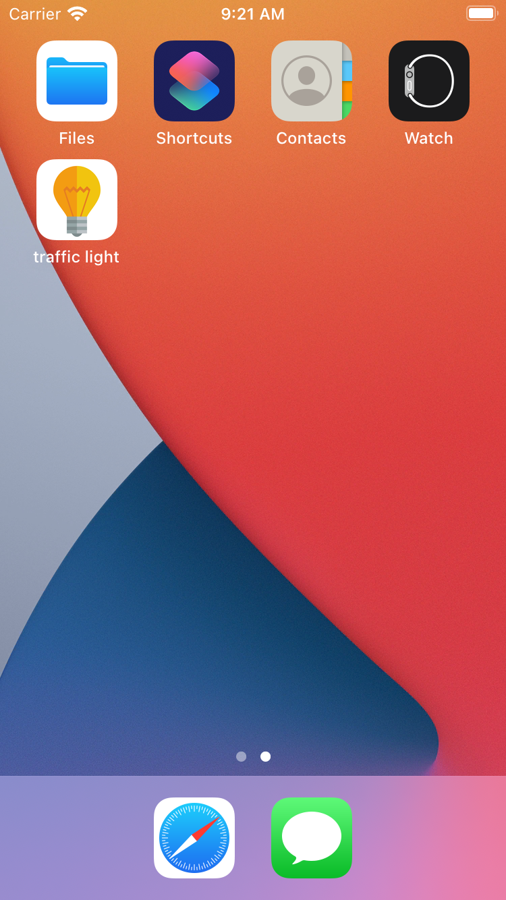
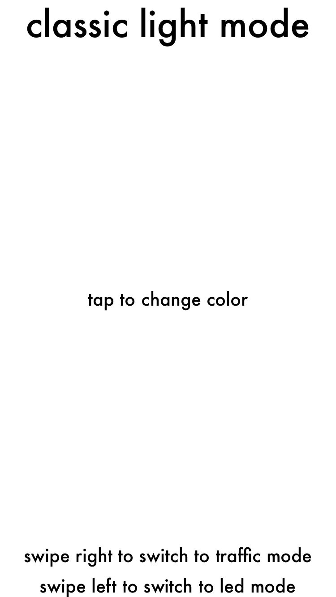
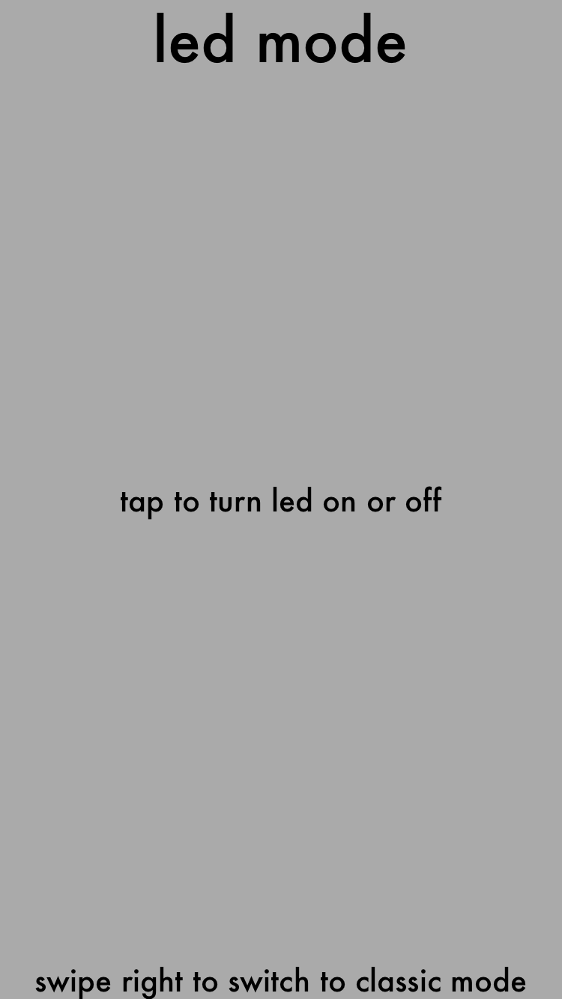

# light

## The light project mda 2020
   В проекте реализован базовый функционал черно белого фонарика из урока, плюс добавлен и сделан главным функционал трехцветного фонарика а также добавлен функционал включения рельного led фонарика на устройстве, реализован переход между режимами по свайпу.
## Screenshots
      

